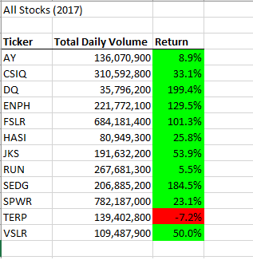
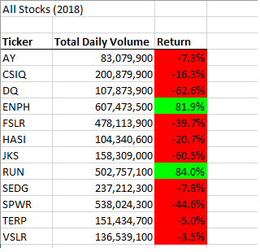

# VBA_Challenge
## Refactor VBA Code and Measure Performance
1.Use  knowledge of VBA and the starter code provided in this Challenge to refactor the Module2_VBA_Script so that this loops through the data one time and collects all of the information. 

2.The tickerIndex is set equal to zero before looping over the rows.

3.Arrays are created for tickers, tickerVolumes, tickerStartingPrices, and tickerEndingPrices.

4.The tickerIndex is used to access the stock ticker index for the tickers, tickerVolumes, tickerStartingPrices, and tickerEndingPrices arrays.

5.The script loops through stock data, reading and storing all of the following values from each row: tickers, tickerVolumes, tickerStartingPrices, and tickerEndingPrices.

6.Code for formatting the cells in the spreadsheet is working.

7.There are comments to explain the purpose of the code.

8.The outputs for the 2017 and 2018 stock analyses in the VBA_Challenge.xlsm workbook match the outputs from the AllStockAnalysis in the module.

9.The pop-up messages showing the elapsed run time for the script are saved as VBA_Challenge_2017.png and VBA_Challenge_2018.png.

## Analysis 

The purpose of this project was to create a program that took the ticker starting and ending prices of stocks for the years 2017 abd 2017. I created buttons to clear the worksheet and to run the stocks analysis. I, also created a message box to show the run-time of the program to show it's accuracy. The advantages of refactoring the code is increasing the speed of calculations (I have the original code listed in Module 6), but the challenges were getting the For-Loop's to correctly run and it was a long process of debugging. Eventually the code worked and I was able to analyze the data: 
    
Looking at the data for 2017
    

Looking at the data for 2018

   
Here, we see that the stocks **ENPH** and **RUN** are both gaining a positive return for each year. The stock **TERP** had a negative return both years and the rest of the stocks were profitable in 2017, but not in 2018. Analyzing this data, I would say that **ENPH** and **RUN** are more stable stocks to invest in. 
